# System-level performance profiling workflow for PyTorch training: Intel VTune Profiler on Intel Data Center GPU Max, and NVIDIA Nsight Systems on NVIDIA Grace Hopper

## Disclaimer (personal content)

This article contains personal technical content about the use of vendor performance profilers. It is based on publicly available information and on the author's own experimentation. The views expressed are solely those of the author and do not represent Intel Corporation or NVIDIA Corporation.

## Performance analysis disclaimer

- Results are specific to the tested configuration and may not represent typical performance.
- Performance varies based on system configuration, workload, and other factors.
- Results are provided for educational purposes and should not be used for procurement decisions.
- Neither Intel nor NVIDIA has validated or endorsed the measurements presented here.
- Reported numbers are representative observations from individual runs, not statistically averaged benchmarks. Your results may differ — always conduct your own testing for your specific use case.

## Trademark attribution

Intel, the Intel logo, VTune, and Intel Data Center GPU Max are trademarks of Intel Corporation. NVIDIA, Nsight, CUDA, cuDNN, CUPTI, and Grace Hopper are trademarks of NVIDIA Corporation. All other trademarks are the property of their respective owners.

## Scope of this article

This article presents **two independent walkthroughs** of a system-level profiling session for a PyTorch training workload, one using Intel VTune Profiler on an Intel Data Center GPU Max system, and one using NVIDIA Nsight Systems on an NVIDIA Grace Hopper system. The walkthroughs are intended as a tutorial on each profiler's workflow, **not** as a head-to-head comparison of the two platforms. The two runs were collected with different model configurations (see [Configuration differences between the two runs](#configuration-differences-between-the-two-runs)), and the numbers from one walkthrough are not transferable to the other.

## Application

[CosmicTagger](https://github.com/coreyjadams/CosmicTagger) is an open-source PyTorch training application for neutrino-event image segmentation that supports multi-process distributed execution and can scale to thousands of compute nodes. The mainline version of the application is used here without platform-specific tuning. The application exposes several built-in time and throughput measurements that complement the wall-clock time reported by the `time` utility.

Both runs use:

- `mode=train`
- `framework=torch`
- `data.synthetic=True`
- `run.distributed=False`
- `run.minibatch_size=4`
- `run.precision=float32`
- `run.iterations=500`
- `data.downsample=1`

The Intel run uses `run.compute_mode=XPU`; the NVIDIA run uses `run.compute_mode=GPU`.

### Configuration differences between the two runs

The two runs were collected at different times and use the application's defaults available on each system at that time. The default network and data-format selections differ, so the two runs do not execute the same model and are not directly comparable. The relevant differences are:

| Parameter | Intel run | NVIDIA run |
|---|---|---|
| `network.name` | `A21` | `uresnet` |
| `network.n_initial_filters` | 8 | 16 |
| `network.connections` | `sum` | `concat` |
| `network.residual` | False | True |
| `network.blocks_final` | 0 | 5 |
| `network.data_format` | `channels_last` | `channels_first` |
| `data.data_format` | `channels_last` | `channels_first` |
| `framework.inter_op_parallelism_threads` | (default) | 2 |
| `framework.intra_op_parallelism_threads` | (default) | 24 |
| `run.saver` | False | True |

The NVIDIA run executes a structurally larger model (more initial filters, residual connections enabled, concatenated skip connections, and five additional final blocks) with a different memory layout, and additionally performs checkpoint I/O. Each walkthrough below describes only the run executed on that platform.

## Profiler versions

- Intel VTune Profiler 2025.10
- NVIDIA Nsight Systems 2025.5.1

## Methodology

A standard top-down performance methodology starts at the highest level, where improvements typically yield the largest impact. In practice, scale-out and single-node behaviour can be analyzed independently and the findings merged later. For brevity, this article focuses on single-node, single-process analysis on each system.

The performance indicator used to anchor each walkthrough is the application-reported `Total time to batch_process` together with the `time` utility's `real` wall-clock time. The application's own `Total time to batch process except first iteration` value is used as a warm-up-excluded measurement. Each walkthrough reports a single representative run; numbers are illustrative of the profiler output and are not statistically averaged.

For remote-host data collection, refer to the VTune Web Server documentation and the Nsight Systems remote SSH target connection documentation.

---

# Part 1 — Intel VTune Profiler walkthrough on Intel Data Center GPU Max

## Platform

- CPU: Intel(R) Xeon(R) Platinum 8469 CPU @2.00GHz (code named Sapphire Rapids) 208 logical Cores / 2 sockets
- System memory: 128 GB DDR5 (Up to 4800 MT/s)
- Accelerator: Intel Data Center GPU Max 1550 (code name Ponte Vecchio), 128 GB HBM2e — [product page](https://www.intel.com/content/www/us/en/products/sku/232873/intel-data-center-gpu-max-1550/specifications.html)
- OS: Ubuntu 24.04

## Software environment

- Python version 3.10
- PyTorch with Intel XPU support 2.8.0
- oneAPI 2025.3 (Intel oneDNN, Intel GPU compute runtime / Level Zero loader, Intel GPU kernel driver i915)

## Run command and observed output

```
time python $PATH_TO_CT/bin/exec.py mode=train framework=torch \
    run.compute_mode=XPU data.synthetic=True data.downsample=1 \
    run.distributed=False run.id=vtune run.saver=False \
    run.minibatch_size=4 run.precision=float32
```

```
INFO - Total time to batch_process: 319.4231
INFO - Total time to batch process except first iteration: 312.2636, throughput: 6.3920
INFO - Total time to batch process last 40 iterations: 25.3643, throughput: 6.3081
real    5m25.659s
```

## VTune analysis configuration

VTune Profiler provides a dedicated **XPU Offload** analysis type for host/device offload workloads. For an initial run, the default settings are sufficient; CPU sampling and call-stack collection for both CPU and GPU functions should be enabled (Figure 1). Collection of GPU hardware metrics and PCIe/memory transfer counters is left disabled for the first pass, since enabling them increases data volume and finalization time. API tracing alone is sufficient to characterize host/device interaction.

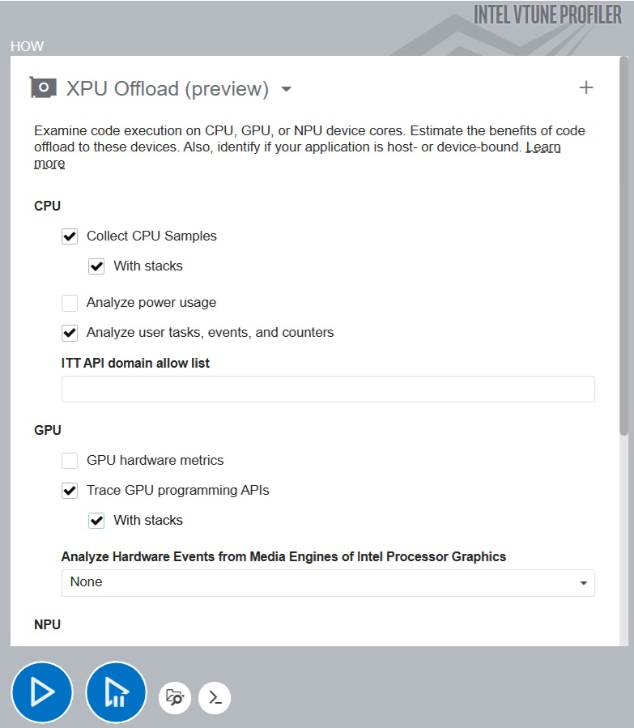

*Figure 1. VTune Profiler XPU Offload configuration.*

## Results

The analysis is read along two axes: where host CPU and device GPU were used and how efficiently, and where each could have been used but was not. Maximizing both the utilization and the efficiency of compute resources is the central objective of system-level performance work.

The XPU Offload Summary (Figure 2) shows that the host CPU spends most of its active time in copying data to and from GPU memory through the Level Zero API function `zeCommandListAppendMemoryCopy`, and in the convolution computing tasks that drive the batch process. CPU functions account for roughly half of the elapsed time, indicating headroom for host-side efficiency improvement. The GPU is busy for roughly half of the elapsed time as well, predominantly in the `gen_conv` kernel. Detailed kernel-level analysis is the domain of VTune's **GPU Compute / Media Hotspots** analysis; the XPU Offload view is used here to characterize whether the GPU was scheduled at all.

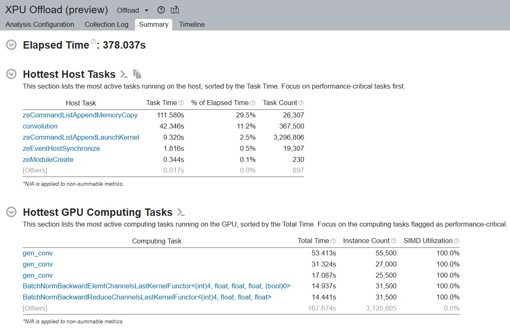

*Figure 2. VTune XPU Offload Summary.*

The timeline view (Figure 3) shows a substantial host-side preparation phase preceding the batch loop, on the order of 40 seconds. While this is roughly 10% of total wall time, it is worth investigating for potential program-level optimizations.

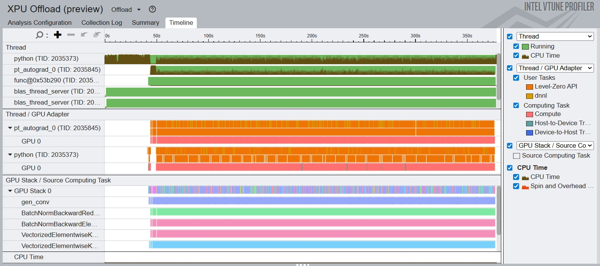

*Figure 3. VTune XPU Offload timeline.*

Filtering on the time frame and the Python process and inspecting call stacks (Figure 4) shows that the bulk of CPU time during the early phase is in memory allocations within `libdwarf` and `libpin`, plus samples attributed to `[Outside any known module]`. This is a known signature of Pin-based instrumentation overhead, where the Pin engine loads Python modules and allocates memory for analysis. The hypothesis can be confirmed by varying `run.iterations` or `run.minibatch_size`: the duration of the initial phase does not change with either, which would not be the case if the time were spent in the workload itself. This overhead can therefore be ignored for the purpose of analyzing the training loop.

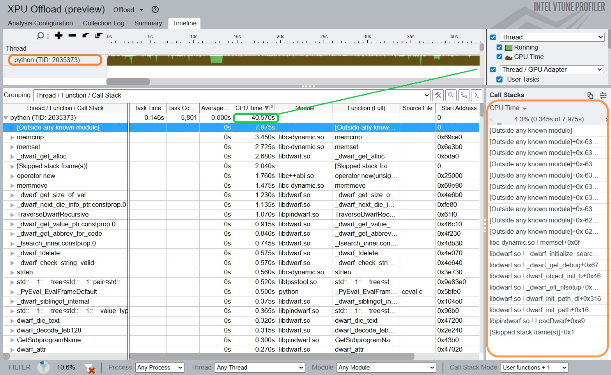

*Figure 4. Python main process with call stacks.*

A short PyTorch model preparation and warm-up sequence precedes the main training iterations (Figure 5).

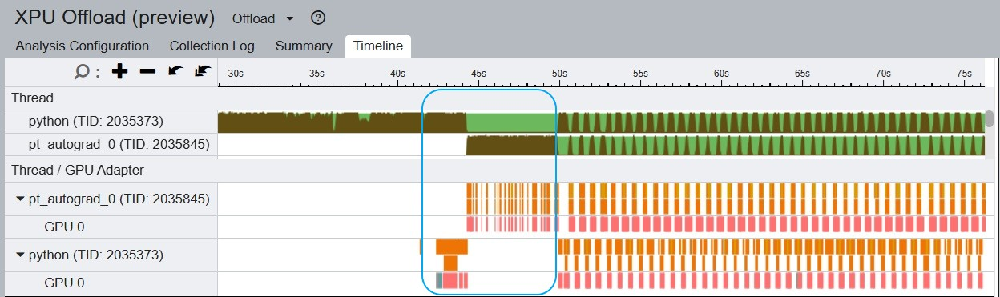

*Figure 5. Warm-up iterations before the main batch process.*

Filtering to the `pt_autograd_0` thread shows oneDNN library interaction with the PyTorch framework and frequent memory-allocation activity (Figure 6).

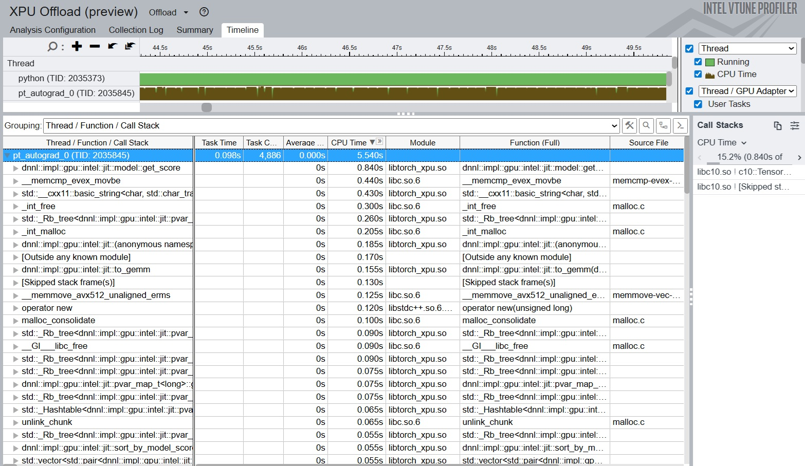

*Figure 6. `pt_autograd_0` thread activity during warm-up.*

In the steady-state portion of the run, each iteration takes approximately 0.65 s and is driven by two Python threads that submit compute work to the GPU in a serialized manner (Figure 7).

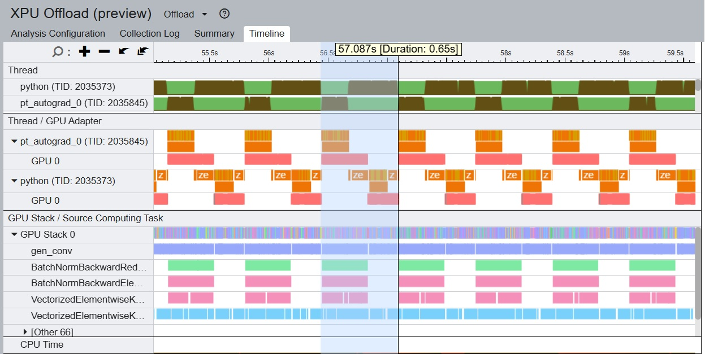

*Figure 7. Sequence of iterations on the Intel GPU.*

Zooming into a single iteration (Figure 8) reveals the following:

1. Although the two Python threads serialize their submissions, both submit work continuously, and GPU stack 0 (one of the two PVC tiles) is kept busy executing kernels.
2. A small number of long `zeCommandListAppendMemoryCopy` calls translate into short copy kernels on the device and do not materially block subsequent kernel execution.

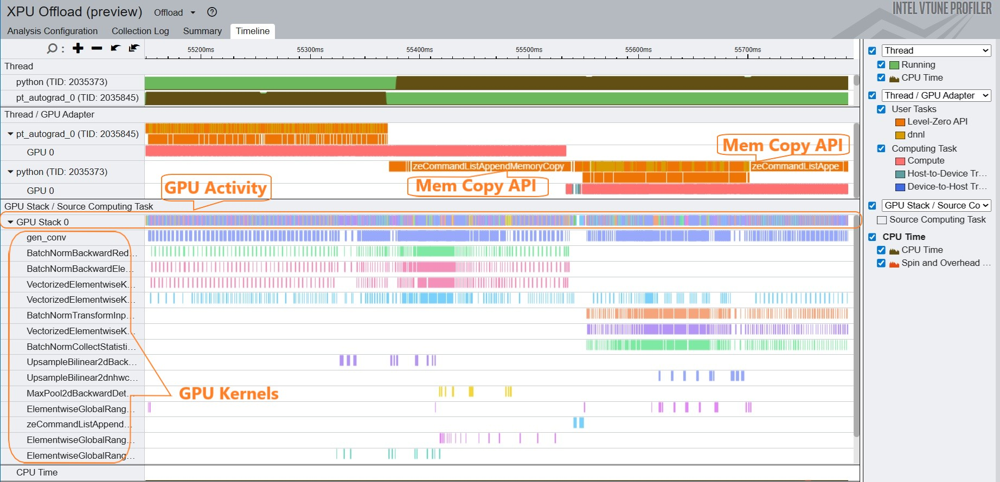

*Figure 8. Single iteration, zoomed.*

Zooming further reveals a series of very short memory-copy and synchronization calls that together add roughly 8 ms before the next kernel launch (Figure 9). These short copies are candidates for coalescing into a single batched transfer at the framework or library layer.

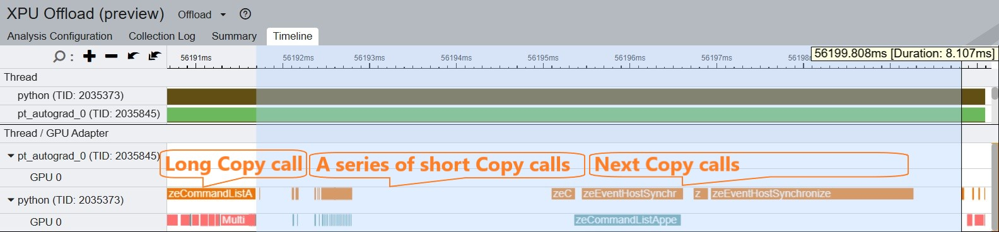

*Figure 9. Short copy and synchronization operations.*

The gaps between iterations show occasional sparse kernel submission, but the gap durations (around 3 ms each, Figure 10) are small enough that optimizing them is unlikely to produce a significant overall improvement.

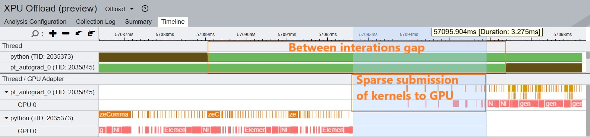

*Figure 10. Gaps between iterations.*

## Summary of findings — Intel run

1. CPU utilization is low. The application is intended to offload all compute to the GPU, so the host is used primarily for memory allocation and transfer and for compute-API calls. Given the available CPU core count and system memory, an algorithmic change that engages more host resources (for example, host-side pre-processing or asynchronous data staging) could yield a substantial improvement.
2. The single GPU device is reasonably well utilized, with minor inefficiencies in copying and synchronizing small data fragments. Further single-system gains can be pursued by scaling out to additional GPU devices or tiles.

---

# Part 2 — NVIDIA Nsight Systems walkthrough on NVIDIA Grace Hopper

## Platform

- NVIDIA GH200 Grace Hopper Superchip 
- NVIDIA Grace CPU: 72 Arm Neoverse V2 cores, Memory 480 GB LPDDR5X, Memory bandwidth 512 GB/s peak
- NVIDIA H100 Tensor Core GPU, Memory 96 GB HBM3e, Memory bandwidth 4000 GB/s peak
- OS: Ubuntu 24.04 (Kernel 6.2.0-1015-nvidia)

## Software environment

- Python version 3.10
- PyTorch: 2.8.0
- CUDA Toolkit: 12.3
- NVIDIA GPU Driver: 545.23.08

## Run command and observed output

```
time python CosmicTagger/bin/exec.py run.id=bringup run.distributed=False \
    framework.name=torch data.synthetic=True +framework.sparse=False \
    run.iterations=500 run.minibatch_size=4
```

```
INFO - Total time to batch_process: 309.7978
INFO - Total time to batch process except first iteration: 300.3929, throughput: 6.6446
INFO - Total time to batch process last 40 iterations: 25.7279, throughput: 6.2189
real    5m17.568s
```

## Nsight Systems analysis configuration

Nsight Systems is run with its default configuration (Figure 11). GPU hardware-metric collection is not enabled by default; turning it on requires an additional option in the configuration window or on the command line, and adds CUPTI overhead.

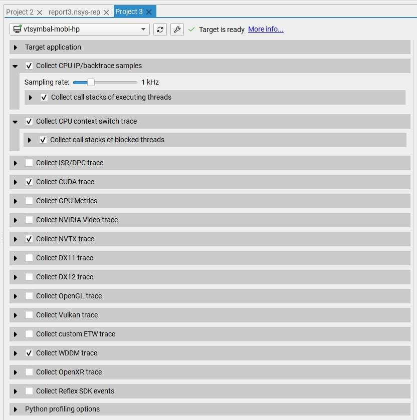

*Figure 11. Nsight Systems profiling configuration.*

## Results

The host-side preparation phase takes roughly 20 s in this run (Figure 12). On the CPU side, the `python` and `pt_autograd_0` threads each occupy approximately half of one CPU core (Figure 13), while a CUPTI worker thread accounts for additional CPU activity. CUPTI runs on a dedicated thread; per-metric host overhead depends on the metrics enabled and should be considered when interpreting CPU-time figures.

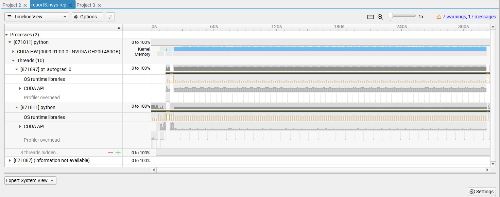

*Figure 12. Nsight Systems timeline view.*

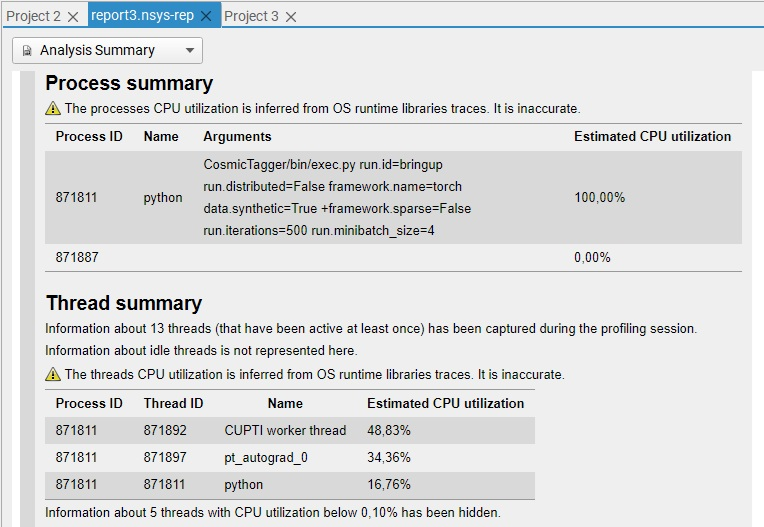

*Figure 13. CPU threads and CPU utilization.*

The preparation phase shows active device-memory allocation through `cudaMalloc` calls (Figure 14).

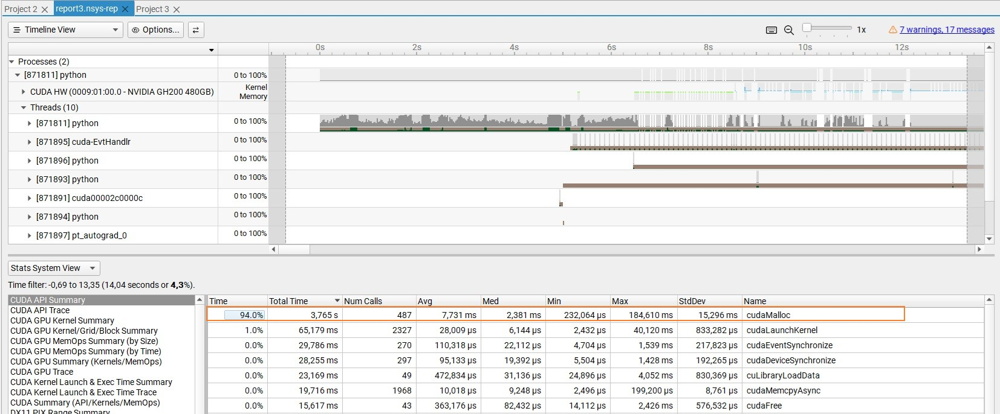

*Figure 14. Preparation phase.*

In the steady-state portion of the run, each iteration takes approximately 0.6 s and is driven by two Python threads that submit work to CUDA streams in a serialized manner (Figure 15). The wait state of the Python threads, displayed in the **OS runtime libraries** lane, is useful for confirming the serialization of submission between the two threads.

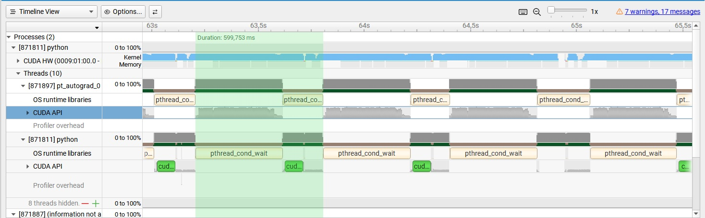

*Figure 15. Sequence of iterations on the NVIDIA GPU.*

Zooming into a single iteration (Figure 16) shows:

1. The two Python threads submit work continuously to streams; the GPU is kept busy executing kernels.
2. A small number of gaps and sparse-submission regions appear. One such region follows a `cudaStreamSynchronize` and contains a sequence of `cudaMemcpyAsync` calls associated with memory rearrangement. These gaps are short (around 6 ms, on the order of 1% of an iteration) and are unlikely to be worth optimizing first.

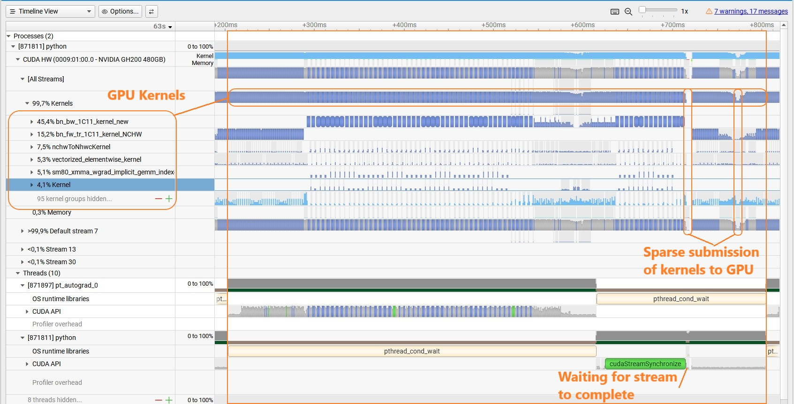

*Figure 16. Single iteration, zoomed.*

After `cudaLaunchKernel`, `cudaStreamSynchronize` is the second-largest CUDA API call by time, accounting for 18% of CPU time (Figure 17). It is the principal point at which the host waits for device-side completion.

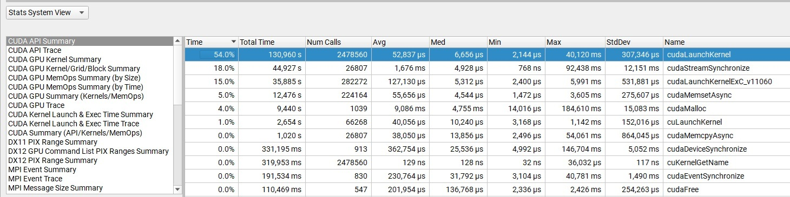

*Figure 17. CUDA API call summary.*

The dominant device-side kernels come from cuDNN convolution paths invoked by the framework (Figure 18). Reducing host-side stream synchronization would require analysis of how the framework dispatches these kernels.

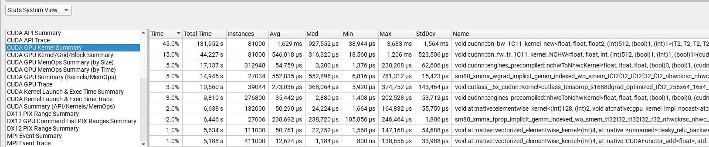

*Figure 18. GPU kernel summary.*

## Summary of findings — NVIDIA run

1. CPU utilization is low. The application is designed to offload all compute to the GPU, so the host is used primarily for memory allocation and transfer and for CUDA API calls. This is a property of the application, not of the platform.
2. The GPU is well utilized, with minor inefficiencies associated with stream synchronization. No memory-capacity constraint was observed in this run, so further single-system gains can be pursued by scaling out to additional GPUs and submitting work in parallel from multiple Python processes.

---

## Closing note

The work described here was conducted independently and is not endorsed by either Intel Corporation or NVIDIA Corporation. The two walkthroughs are presented as a tutorial on each profiler's workflow on a representative PyTorch training application. Readers planning a benchmark-quality study should align model configuration, software versions, and run parameters across systems, repeat each measurement, and report statistical summaries.
